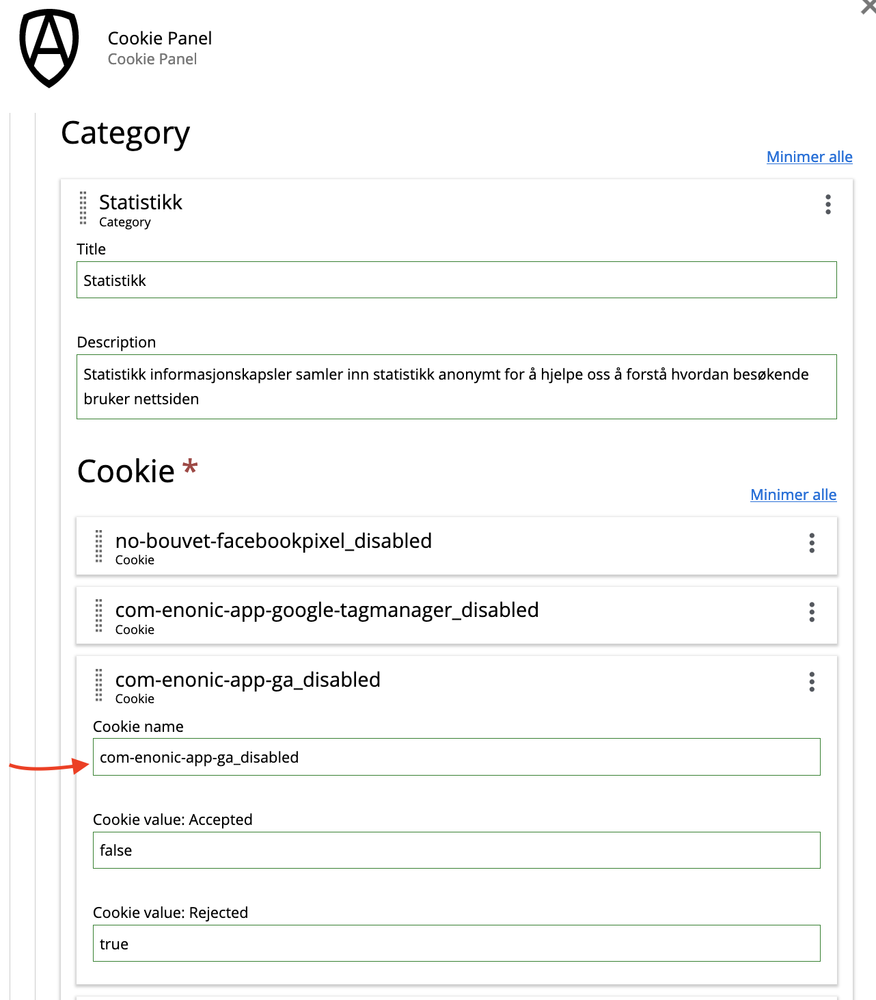

# Cookie Panel for Enonic XP
Opt-in Cookie Panel for Enonic XP.

## How it works
Cookie Panel works by setting a few user-definable functional control cookies to communicate with other apps that they shouldn't add their tracking to
the the site. By default, before the user has consented to tracking cookies, all these cookies are set to their rejected value
by Cookie Panel.

Once the user has consented to the specific cookie categories, Cookie Panel will set the control cookies to their accepted value to communicate to the
other apps that they now can render their content.

## Features
- Opt-in cookie consent for your users
- Custom cookie groups/categories that users can enable/disable individually
- Easy integration with other applications
- Built-in light and dark themes to fit most site designs
- Custom styling if you want something different from the built-in themes
- Content Security Policy compatible

## Customizing
You can add CSS styling in your own applications to make the panels fit any design you want.

### Open settings panel from a link or button
There are 2 ways to add buttons that directly open the cookie settings panel.

#### URL parameter
If you add a cookie_settings=true parameter to your URL, Cookie Panel will load and open its settings
?cookie_settings=true

#### Button attribute
You can add your own button to open the the panel with the attribute `data-cookie-panel-selector="open-settings"`

```
<button data-cookie-panel-selector="open-settings">
  Open cookie settings
</button>
```

### Refresh on save
If you have serverside rendered components that need specific consent from the user before presenting it to the user (external video players etc),
you can tell Cookie Panel that the page needs refreshing after saving cookie settings. To do this, you add an application/json script block
to your page with a specific selector attribute Cookie Panel can pick up. If you add this using page contributions from the parts that require
a reload to properly render, this behaviour will only affect pages using those parts and not reload if the parts aren't used.

```
<script data-cookie-panel-selector="page-config">
  { reloadOnSave: true }
</script>
```

### Run code on consent
As an alternative to having to refresh the page after consent is given, your app can add a function to be run when consent is given. When consent is given to a category, the app will run a function for each cookie in that categroy, if there is any.

Register a function on the `window.__RUN_ON_COOKIE_CONSENT__` object, the key being the same as the cookie name in the cookie panel app config.

With this site config:


You would register in your app frontend JS like this:

```
window.__RUN_ON_COOKIE_CONSENT__ = window.__RUN_ON_COOKIE_CONSENT__ || {};
window.__RUN_ON_COOKIE_CONSENT__["com-enonic-app-ga_disabled"] = function () {
  // Code to be run on consent
}`;

```

A combonation of checking value of cookie on server and using `__RUN_ON_COOKIE_CONSENT__`should be used to optimize your app.

## Integrating
Cookie Panel works out of the box with these apps:
- [Google Tag Manager](https://github.com/bouvet-apps/app-google-tag-manager/tree/feature/cookie-panel-support/dist)
- [Google Analytics](https://github.com/bouvet-apps/app-google-analytics/tree/feature/cookie-panel-support/dist)
- [Facebook Pixel](https://github.com/bouvet-apps/app-facebook-pixel/tree/feature/cookie-panel-support)

## Version history

### 1.0.0 Initial release

